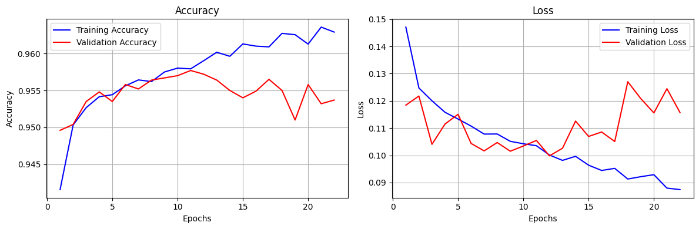

# Customer Purchase Prediction – ANN Model

This project builds and deploys an Artificial Neural Network (ANN) to predict whether a customer is likely to make a purchase, based on demographic and behavioral features.  
The solution includes data preprocessing, model training, evaluation, and deployment with a simple app interface.

---

## 📂 Project Structure
```
.
├── customerData.csv                 # Original dataset (50,000 rows)
├── ann_customer_purchase_prediction.ipynb   # Main notebook (preprocessing + model training)
├── app.py                           # Streamlit app for deployment
├── train.ipynb                      # Training script (alternative to main notebook)
├── accuracy_loss.png                 # Training accuracy/loss curves
├── models/                          # (Optional) Saved models and encoders
│   ├── purchasePredictionModel.h5
│   ├── scaler.pkl
│   ├── label_encoder_gender.pkl
│   └── onehot_encoders_*.pkl
```

---

## ⚙️ Installation

1. Clone this repository:
   ```bash
   git clone https://github.com/your-username/customer-purchase-prediction.git
   cd customer-purchase-prediction
   ```

2. Create and activate a virtual environment:
   ```bash
   python -m venv venv
   source venv/bin/activate   # Mac/Linux
   venv\Scripts\activate      # Windows
   ```

3. Install dependencies:
   ```bash
   pip install -r requirements.txt
   ```

---

## 📊 Dataset

- The dataset contains **50,000 entries** of customer records.
- Features include demographics (Age, Gender, Region), behavior (Purchases, Time spent, Discounts availed), and loyalty information.
- Target: **PurchaseStatus (0/1)**.

Synthetic expansion to 500k rows can also be generated for large-scale testing.

---

## 🧠 Model Architecture

- Input: Encoded + scaled feature set
- Hidden Layers:
  - Dense(128, ReLU, with L2/Dropout)
  - Dense(64, ReLU)
- Output: Dense(1, Sigmoid)
- Loss: `binary_crossentropy`
- Optimizer: `Adam`
- Callbacks: EarlyStopping (patience=10, restore best weights), TensorBoard

---

## 🚀 Training

Run the notebook or the training script:

```bash
jupyter notebook ann_customer_purchase_prediction.ipynb
```

or

```bash
python train.ipynb
```

The model and preprocessing objects are saved as:

- `purchasePredictionModel.h5`
- `scaler.pkl`
- `label_encoder_gender.pkl`
- `onehot_encoders_*.pkl`

---

## 🌐 Deployment (Streamlit App)

Run the app locally:

```bash
streamlit run app.py
```

This opens a web UI where you can enter customer details and get a prediction.

---

## 📈 Results

- Validation Accuracy: ~92.5%
- Validation AUC: ~0.93
- Stable training with minimal overfitting
- Example accuracy/loss curve:



---

## 🏷️ Use Cases

- Predict customer purchase likelihood
- Support loyalty program targeting
- Guide marketing campaign personalization
- Forecast sales in e-commerce/retail

---

## 🛠️ Requirements

- Python 3.9+
- TensorFlow 2.x
- scikit-learn
- pandas, numpy, matplotlib
- streamlit (for app)

Install with:

```bash
pip install tensorflow scikit-learn pandas numpy matplotlib streamlit
```

---

## 📌 Author

Developed by Gautham Vijayaraj.  
Feel free to fork, improve, and use for your own ML projects!
